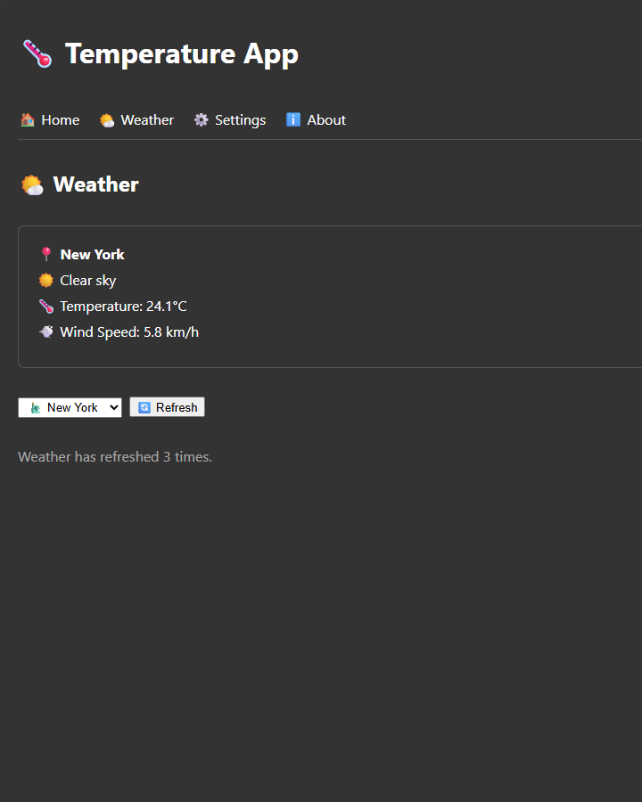
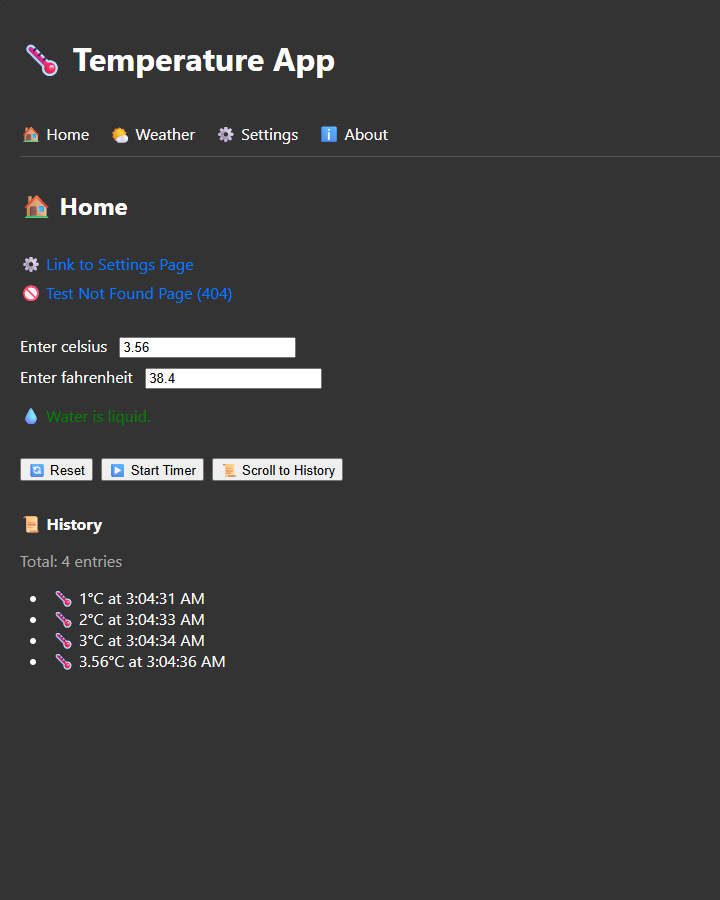
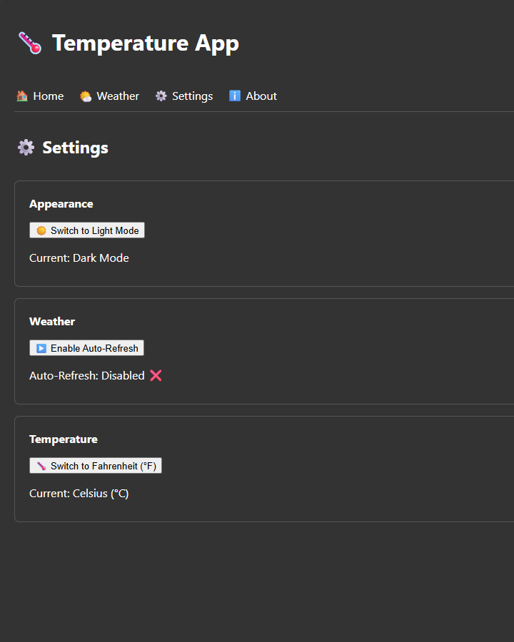

# 🌡️ Temperature App

A modern, feature-rich React application for checking weather conditions and converting temperatures. Built with React, TypeScript, and Zustand.

[](https://opensource.org/licenses/MIT)
[](https://reactjs.org/)
[](https://www.typescriptlang.org/)
[](https://vitejs.dev/)

## 📚 Table of Contents

- [Demo](#demo)
- [Features](#features)
- [Tech Stack](#tech-stack)
- [Project Structure](#project-structure)
- [Installation](#installation)
- [Usage](#usage)
- [Testing](#testing)
- [Contributing](#contributing)
- [License](#license)

## 🎯 Demo








*Screenshot of the Temperature App showing weather information, temperature conversion, and dark mode.*

## ✨ Features

### Core Features
- 🌤️ **Real-time Weather Data** – Fetches current weather from the [Open-Meteo API](https://open-meteo.com/)
- 🌡️ **Temperature Conversion** – Seamlessly switch between Celsius and Fahrenheit
- 🌓 **Dark Mode Support** – Toggle between light and dark themes (persists in localStorage)
- 📊 **History Tracking** – Records temperature changes with timestamps
- 💾 **History Export** – Download temperature history as a JSON file
- 🔄 **Auto-Refresh** – Automatically updates weather data at configurable intervals
- 🏙️ **City Selection** – Choose from multiple cities worldwide

### Technical Highlights
- 🧩 **Modular Architecture** – Clean separation of concerns with custom hooks
- 🎯 **Type Safety** – Full TypeScript support for reliable code
- 🧪 **Comprehensive Testing** – Unit tests with Vitest and React Testing Library
- ⚡ **Performance Optimized** – Uses `useMemo`, `useCallback`, and `React.memo`
- 🗄️ **State Management** – Zustand for global state with persistence
- 📡 **Data Fetching** – React Query for efficient server state management
- 🔍 **DevTools** – Integrated React Query DevTools for debugging

## 🛠️ Tech Stack

### Frontend
| Technology | Purpose |
|------------|---------|
| [React 18](https://reactjs.org/) | UI library with hooks |
| [TypeScript 5](https://www.typescriptlang.org/) | Type-safe JavaScript |
| [Vite 4](https://vitejs.dev/) | Build tool and dev server |
| [Zustand 4](https://zustand-demo.pmnd.rs/) | Global state management |
| [React Query 5](https://tanstack.com/query) | Server state management |
| [React Router 6](https://reactrouter.com/) | Client-side routing |

### Testing
| Technology | Purpose |
|------------|---------|
| [Vitest 4](https://vitest.dev/) | Test runner |
| [React Testing Library](https://testing-library.com/react) | Component testing |
| [Jest DOM](https://github.com/testing-library/jest-dom) | DOM assertion matchers |

### Development Tools
| Technology | Purpose |
|------------|---------|
| [ESLint](https://eslint.org/) | Code linting |
| [Prettier](https://prettier.io/) | Code formatting |

## 📁 Project Structure

```
temperature-app/
├── src/
│   ├── components/
│   │   └── BoilingVerdict.tsx    # Reusable temperature display component
│   ├── hooks/
│   │   ├── useAppStoreHooks.ts   # Zustand store selectors
│   │   └── useWeatherQuery.ts    # React Query integration
│   ├── pages/
│   │   ├── HomePage.tsx          # Main temperature page
│   │   ├── WeatherPage.tsx       # Weather display page
│   │   ├── SettingsPage.tsx      # App settings
│   │   ├── AboutPage.tsx         # About information
│   │   └── NotFoundPage.tsx      # 404 error page
│   ├── store/
│   │   └── useAppStore.ts        # Zustand store configuration
│   ├── test/
│   │   └── setup.ts              # Test configuration
│   ├── App.tsx                   # Main app component with routing
│   ├── main.tsx                  # Entry point with providers
│   └── style.css                 # Global styles
├── public/
├── .gitignore
├── index.html
├── package.json
├── tsconfig.json
├── vite.config.js
└── README.md
```

## 🚀 Installation

### Prerequisites
- [Node.js](https://nodejs.org/) (v18 or higher)
- [npm](https://www.npmjs.com/) (v9 or higher) or [yarn](https://yarnpkg.com/)

### Setup Instructions

1. **Clone the repository**
   ```bash
   git clone https://github.com/tolkensak/temperature-app.git
   cd temperature-app
   ```

2. **Install dependencies**
   ```bash
   npm install
   # or
   yarn install
   ```

3. **Start the development server**
   ```bash
   npm run dev
   # or
   yarn dev
   ```

4. **Open your browser**
   Navigate to [http://localhost:5173](http://localhost:5173)

## 💻 Usage

### Available Scripts

| Command | Description |
|---------|-------------|
| `npm run dev` | Starts development server with hot reload |
| `npm run build` | Builds the app for production |
| `npm run preview` | Previews the production build locally |
| `npm run test` | Runs the test suite in watch mode |
| `npm run test:ui` | Runs tests with Vitest UI |
| `npm run test:coverage` | Generates test coverage report |

### Key Features in Action

#### 🌤️ Weather Page
- Select a city from the dropdown
- Click "Refresh" to fetch the latest weather
- Toggle "Auto Refresh" for automatic updates (every 30 seconds)
- View temperature in your preferred unit (°C/°F)

#### 🌡️ Temperature Conversion
- Enter a temperature in Celsius or Fahrenheit
- The other input updates automatically
- View the boiling/ freezing verdict for water

#### 📜 History
- Temperature changes are automatically recorded with timestamps
- Export history as a JSON file
- Clear history with the reset button

#### ⚙️ Settings
- Toggle dark mode (persists across sessions)
- Enable/disable auto-refresh
- Switch between Celsius and Fahrenheit

## 🧪 Testing

### Running Tests

```bash
# Run all tests
npm run test

# Run tests with UI
npm run test:ui

# Generate coverage report
npm run test:coverage
```

### Test Coverage

| Module | Tests | Status |
|--------|-------|--------|
| HomePage | 4 | ✅ Passing |
| WeatherPage | 4 | ✅ Passing |
| SettingsPage | 4 | ✅ Passing |
| BoilingVerdict | 3 | ✅ Passing |
| useWeatherQuery | 4 | ✅ Passing |

Total: **19 tests** all passing ✅

## 🤝 Contributing

Contributions are welcome! Here's how you can help:

1. **Fork the repository**
2. **Create a feature branch**
   ```bash
   git checkout -b feature/amazing-feature
   ```
3. **Commit your changes**
   ```bash
   git commit -m 'Add amazing feature'
   ```
4. **Push to the branch**
   ```bash
   git push origin feature/amazing-feature
   ```
5. **Open a Pull Request**

### Development Guidelines
- Follow TypeScript best practices
- Write tests for new features
- Ensure all tests pass before submitting PR
- Use conventional commit messages

## 📄 License

This project is licensed under the MIT License - see the [LICENSE](LICENSE) file for details.

## 🙏 Acknowledgments

- [Open-Meteo API](https://open-meteo.com/) for free weather data
- [React Documentation](https://react.dev/) for excellent learning resources
- The amazing open-source community for making modern web development possible

## 📞 Contact

**Tolkensak** – [GitHub](https://github.com/tolkensak)

Project Link: [https://github.com/tolkensak/temperature-app](https://github.com/tolkensak/temperature-app)

---

## 🎓 What This README Includes

| Section | Purpose |
|---------|---------|
| **Badges** | Visual indicators of tech stack and license |
| **Features** | Clear list of what the app does |
| **Tech Stack** | Technologies used with explanations |
| **Project Structure** | Organized file tree for navigation |
| **Installation** | Step-by-step setup instructions |
| **Usage** | Available scripts and feature walkthrough |
| **Testing** | Test coverage and commands |
| **Contributing** | Guidelines for open-source collaboration |
